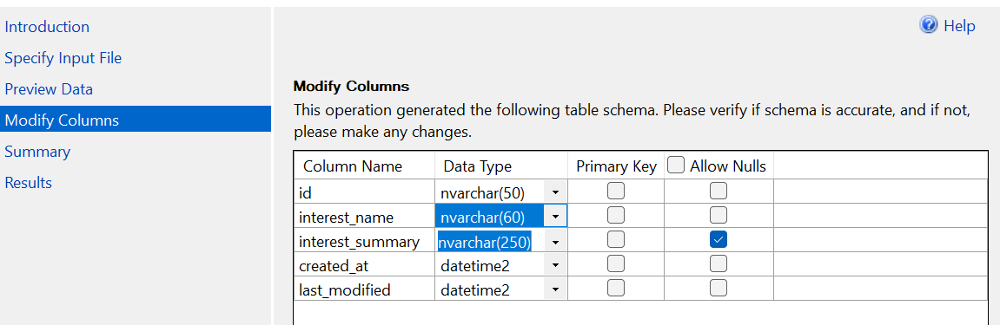

# Fresh Segments | T-SQL Case Study #8 - Danny Ma' 8 Week SQL Challenge

## Overview
Fresh Segments helps businesses understand how their customers behave online, specifically which interest segments their audience engages with and how that engagement stacks up against other clients on the platform.

This is Case Study #8 from Danny Ma's [8 Week SQL Challenge](https://8weeksqlchallenge.com/case-study-8/). I worked through the full analysis in T-SQL, starting from a messy raw table all the way through to index-level composition trends and business recommendations.

## Dataset
Two tables, straightforward structure:
- interest_metrics - Monthly performance per interest - composition, index_value, ranking, percentile_ranking
- interest_map - Maps interest_id to name, summary, created and modified dates

Before diving into the analysis, it helps to udnerstand what these metrics actually mean:
- composition - the percent of this client's customer list that interacted with a given interest in that month
- index_value - how that composition compares to the average across ALL Fresh Segments clients for the same interest. A 6x index means this client's audience is 6 times more liekly to engage with that interest than the average client.
- ranking/percentile_ranking - where the interest sits relative to others in the same month, based on index_value

## Repo Structure
Fresh-Segments-T-SQL-Customer-Interest-Analysis/
```
|
|---README.md                                               ← you are here
|
|
|-- datasets/
|    |-- interest_metrics.csv
|    |-- interest_map.csv
|
|
|--- Images/
|    |-- data_type_modification_snip.png                 ← import settings reference
|
|
|-- 01_data_exploration_and_cleansing/   
|    |-- data_exploration_and_cleansing.sql
|    |-- README.md
|
|
|-- 02_interest_analysis/
|    |-- interest_analysis.sql
|    |-- README.md
|
|
|-- 03_segment_analysis/
|    |-- segemnt_analysis.sql
|    |-- README.md
|
|
|-- 04_index_analysis/
     |-- index_analysis.sql
     |-- README.md

```

Each folder has a .sql file to run that section in one go and a README with the query logic, outputs and interpretations for every question in that section.

## Analysis  - Section by Section

### 01 Data Exploration & Cleansing
- Converted month_year from text to DATE using DATEFROMPARTS().
- Identified and removed 1,194 null records (8.37% of dataset) after backup.
- Confirmed O orphaned interest id values in metrics-all map cleanly to the Interest map table
- Resolved 188 apparent month_year < created_at discrepancies, all fell within the same calendar month, no true data errors

### 02 Interest Analysis
- 480 interests appear across all 14 months - the most reliable segments for trend analysis.
- Cumulative percentage analysis shows interests present 6+ months account for 90.85% of all records-used as the quality threshold.
- Applying the threshold removes 400 records (3.06%) - minimal loss, meaningful quality gain.
- Post-filter, healthy segment diversity is retained across all 14 months.

### 03 Segment Analysis
- Top composition interests are dominated by luxury travel, premium retail and fitness - Work Comes First Travelers peaks at 21.2% composition, Gym Equipment Owners at 18.82%.
- Winter Apparel Shoppers holds a perfect average ranking of 1, highest index_value every single month it appeared.
- 5 most volatile interests (led by Techies at 30.18 std dev) all follow the same pattern. Peaked in mid-2018, steadily declined through 2019. Directional, not random.
- Customer profile: affluent, career-driven, health-conscious. Premium and lifestyle products will land. Budget messaging will not.

### 04 Index Analysis
- Work Comes First Travelers dominates the monthly top spot from September 2018 through February 2019, peaking at 9.14 avg composition in October 2018.
- Alabama Trip Planners, Luxury Bedding Shoppers and Solar Energy Researchers appear most consistently, each in 10 out of 14 monthly top 10 lists.
- Average top 10 composition peaks at 7.07 in October 2018 then drops sharply from May 2019 (falling to 2.43 by June). This is not individual interests declining, the entire top tier loses engagement.
- 3-month rolling average confirms the trend, peaks at 8.58 in December 2018, declines to 2.77 by August 2019. A 70%+ fall that points to a structural issue, not seasonal issue.

### SQL Concepts Used
- `ALTER TABLE`, `UPDATE`, `DATEFROMPARTS()` - Converting month year to proper DATE format
- `SELECT INTO` - Backup before deleting null records
- `FULL OUTER JOIN` - Orphan interest_id check across both tables
- `CTEs` (multi-level) - All complex queries throughout
- `DECLARE` + `SET` - Storing total count upfront for cleaner percentage calculations
- `DENSE_RANK()`, `RANK()` with `OVER/PARTITION BY` - Monthly rankings, peak composition leolation
- `RANK()` over `ROW_NUMBER()` - Deliberate choice to avoid silently dropping tied values
- `SUM() OVER()` - Cumulative percentage across total months
- `MIN()`, `MAX()` as window functions - Boundary value stamping without collapsing rows
- `FIRST_VALUE()` - Pulling month_year at min/max percentile boundaries
- `LAG()` - Previous month context for rolling average output
- `STDEV()` - Measuring volatility in percentile_ranking
- `ROWS BETWEEN 2 PRECEDING AND CURRENT ROW` - 3-month rolling average
- `CONCAT()` - Formatting "Interest: value" output
- `TOP IN WITH TIES` - retains all records tied
- `DATETRUNC()` - Month-level validation of created_at discrepancies

### How to Run
1. Import the CSVs, refer to the below screenshot for data type settings during import.

   [Download interest_map](./datasets/interest_map.csv) & [Download interest_metrics](./datasets/interest_metrics.csv)
   
   
   
2. Run 01_data_exploration_and_cleansing first. It modifies the interest_metrics table.
3. Each folder's sql file runs that section independently after that.
4. Written in T-SQL; minor adjustments needed for PostgreSQL (DATEFROMPARTS → MAKE_DATE, DATETRUNC syntax differs slightly)

### Connect with me
If you have any questions about this anaysis or want to discuss query optimization, feel free to reach out!
[Linkedin](https://www.linkedin.com/in/purti1003/)


